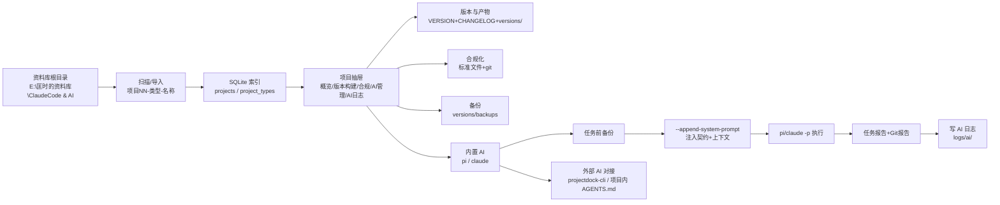

# ProjectDock 管理逻辑与 AI 协作报告

> 版本：v0.5.x · 更新：2026-08-12
> 本文档梳理「项目文件夹如何被管理」与「AI agent 如何参与管理」的完整逻辑链路。

---

## 1. 整体链路（一张图）



---

## 2. 项目文件夹管理逻辑

### 2.1 目录约定
- 管理根目录：`E:\匡时的资料库\ClaudeCode & AI`（可在设置里改，环境变量 `PROJECTDOCK_ROOT` 优先）。
- 项目文件夹统一命名：`项目NN-类型-名称`（如 `项目13-软件-GinyVoC`），类型内置 7 种：软件/网站/游戏/PPT/文稿/脚本/其他，也支持自定义类型。
- 新建项目走「预设一键初始化」：按类型生成骨架文件 + `git init` + 首次提交，可选自动建 GitHub 仓库并推送。
- 已有文件夹可「导入项目」纳入管理（磁盘扫描识别类型）。

### 2.2 每个项目内的标准文件（合规基线）
| 文件 | 作用 |
|------|------|
| `VERSION` | 当前版本号（唯一权威来源，如 `0.5.0`） |
| `CHANGELOG.md` | 语义化版本更新日志（`## [x.y.z] - 日期` + `### 分组`） |
| `README.md` | 项目说明 |
| `.gitignore` | git 忽略（`versions/`、`dist/`、`build/` 等构建产物默认不入库） |
| `AGENTS.md` | 项目契约：按类型渲染的管理规范，供内置/外部 AI agent 遵守 |
| `scripts/` | 构建/发布脚本（`build*.py`、`archive-*.mjs` 等） |

> 合规化 = 逐项检查这些文件与 git 状态，缺失可一键补建；工具只创建/归档，**永不删除文件**（删除必须用户确认）。

### 2.3 版本与构建产物布局
- 已发布版本：`versions/vX.Y.Z/` 目录，内含 `dist/`（二进制/散装包）、`installer/`（安装包）、可选 `src/`（源码快照）。
- 未归档构建：项目根目录 `dist/`、`installer/`、`build/` 里的产物；界面会标记「未归档」并提示一键合规归档。
- 扫描规则：`versions/*/dist|installer` 全部列出（二进制 + 散装 onedir 目录）；根目录 `dist/` 列全部，`installer/build` 只认顶层二进制（exe/msi/zip 等），同版本内与根目录的同名同大小重复自动去重。
- 「最新构建」= 版本目录 + 根目录产物按修改时间倒序合并；若根目录存在比最新归档版本更新的产物，标 ⚠「未归档」。
- 「版本与构建」Tab 已支持分段折叠（当前版本/更新日志/构建产物/构建脚本），默认折叠，可一键全部展开/折叠。

### 2.4 备份
- 每个任务执行前自动创建快照 `versions/backups/pd_backup_<时间戳>.zip`；概览页可手动「立即备份」。
- 备份管理面板：列表 / 恢复（恢复前自动再备份一次）/ 删除；恢复跳过 `.git`、`versions/`、`dist/` 等顶层目录，并做路径穿越防护。
- 备份只存本地 `versions/backups/`（git 已忽略，不会误传 GitHub）。

### 2.5 索引与状态
- SQLite（`%APPDATA%/ProjectDock/`）保存项目索引与类型配置；磁盘为事实源，扫描可重建索引。
- 并发安全：所有 DB 操作经全局锁串行化（修复了多请求并发访问导致的随机 500——即「首次打开版本信息读取失败」的根因）。

---

## 3. 与 AI agent 的协作逻辑

### 3.1 三种入口
1. **App 内置 AI 管理**：项目抽屉 →「AI 管理」Tab，自然语言下指令，实时回显。
2. **总控台批量指令**：勾选多个项目，统一发一条指令，逐项目生成任务并自动写日志。
3. **外部 agent 对接（推荐用于开发流程）**：
   - 项目内已生成契约 `AGENTS.md`，Claude Code / Pi 直接在该目录跑时会自动读取，遵守 ProjectDock 规范；
   - `projectdock-cli` 提供 `contract/context/status/log/logs/init/build/archive/release` 子命令，agent 可按需调用（如归档、构建、写日志）。

### 3.2 上下文如何注入（本次修复重点）
- 内置 AI 发任务时，ProjectDock 先拼「系统提示词」= 项目身份 + 类型结构约定 + 确认策略 + 常见任务解读 + 动态上下文（当前版本/git 状态/产物概况）。
- 该上下文**通过 `--append-system-prompt <临时文件>` 注入 pi/claude 的系统提示词**，消息体只放用户的原话任务 +「直接执行、不要只做介绍」指令。
- 效果：agent 不再把「管理规范」当成要回答的内容，而是当作行为准则去执行任务。
- 临时上下文文件任务结束后自动清理。

### 3.3 任务执行链路
```
用户指令 → [1] 任务前备份 → [2] 流式执行 agent（状态条显示"正在思考/正在调用 pi…"）
        → [3] 任务报告（完成/失败+退出码）→ [4] Git 报告（变更文件列表+最新提交）
        → [5] 写 AI 操作日志 logs/ai/*.json → [6] 前端时间线展示
```
- 前端支持 Markdown 渲染、文本选中复制、每条回复一键复制、agent 活动状态条。
- 确认策略：设置里可配置哪些高危操作（推送/删除/建仓/发布/归档）需要用户确认；默认全自动会直接执行。

### 3.4 日志与审计
- 每条 AI 操作写 `logs/ai/YYYYMMDD_HHMMSS_<ns>_<agent>.json`，含 agent/动作/结果/摘要/详情/备份/Git 信息。
- 「AI 日志」Tab 按 (时间, 名称) 排序展示；总控台聚合跨项目最近操作。

---

## 4. 本轮修复的 4 个问题（根因 → 修法）

| 现象 | 根因 | 修法 |
|------|------|------|
| 首次打开项目偶发「版本信息读取失败」，重开成功 | SQLite 连接跨线程共用，抽屉并发请求随机触发 `sqlite3.InterfaceError` 500 | db.py 全局 RLock 串行化所有 DB 操作；前端失败后显示「重新加载」按钮 |
| GinyVoC / ProjectDock 版本构建读不出产物 | 同上（并发 500 导致 /versions、/builds 失败） | 同上 + 版本/根目录产物去重，实测 GinyVoC 48 行产物正常渲染 |
| AI agent 布置任务后只介绍项目、不执行 | 整套管理规范被塞进消息体，模型把它当回复内容；任务指令被淹没 | 上下文改经 `--append-system-prompt` 注入系统提示词，消息只留用户任务 +「直接执行」指令；pi 实测成功创建文件并出报告 |
| 切换项目偶发显示别的项目信息 | 旧请求响应覆盖新项目（竞态） | 抽屉序号守卫（seq），旧项目响应直接丢弃；headless 实测切换后数据正确、0 JS 错误 |

---

## 5. 后续可扩展方向
- 让外部 agent（Claude Code）在对话中直接调用 `projectdock-cli` 完成归档/构建/发布，ProjectDock 只做审计与 UI（用户此前已确认的方向）。
- 版本「散装包/便携版/debug 版」二级菜单已支持打开/定位/复制；可进一步做「归档后校验产物哈希」。
- GinyVoC 根目录仍有 6 个与已归档产物完全相同的重复文件（约 535MB），等待用户确认后删除。