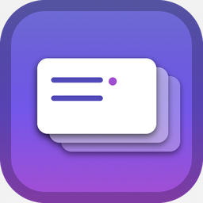
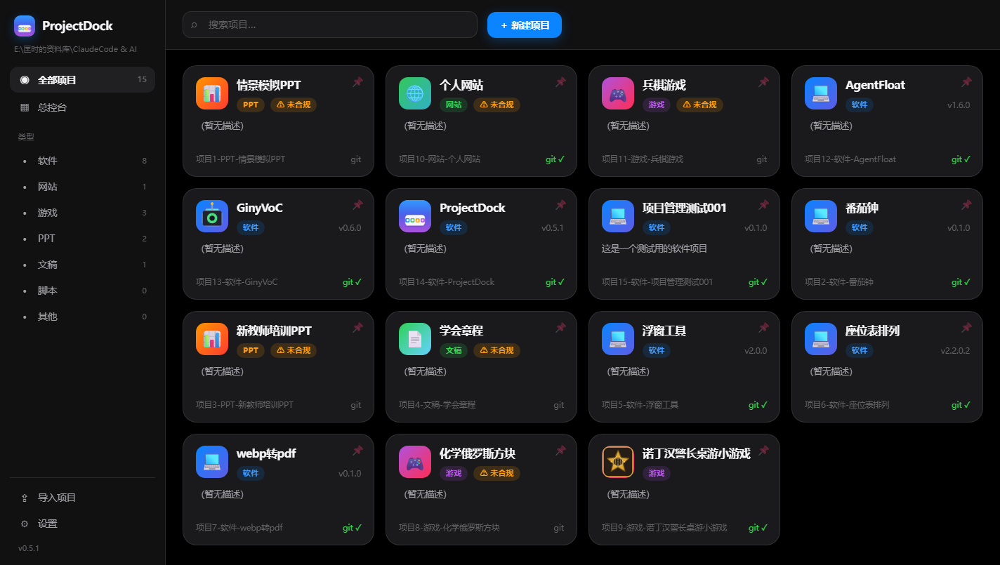

# 🚀 ProjectDock 项目坞

> 本地项目文件管理器 · iOS 风格 · 内置 AI 项目助手 · 全自动版本与归档管理

把你的所有项目文件夹收进一个清爽的 iOS 风格界面，统一创建、初始化、管理版本与构建产物，并让 AI agent 直接帮你干活——**先备份，再执行，后报告**。

<p align="center">
  
</p>

## ✨ 特性

| 能力 | 说明 |
|------|------|
| 🗂️ 自由创建项目 | 内置 软件 / 网站 / 游戏 / PPT / 文稿 / 脚本 / 其他 7 类，支持自定义类型（目录结构 / 骨架文件 / 是否 git） |
| 📌 项目置顶 | 一键置顶常用项目，置顶分区单独展示；支持图格 / 列表视图切换、多种排序方式 |
| ⚡ 预设一键初始化 | 按类型生成骨架（README / VERSION / CHANGELOG / .gitignore / AGENTS.md）+ git init + 首次提交，可选自动建 GitHub 仓库并推送 |
| 🎨 图标管线 | 每个项目可**一键生成** iOS 风格图标（按类型配色 + 12 种符号）或**上传**自定义图片，写入 `logo.png` 立即生效 |
| 🧩 统一管理 | SQLite 索引 + 磁盘扫描双轨；搜索 / 类型筛选 / 导入已有文件夹 / 打开目录 |
| 📦 版本与构建 | 读取 VERSION / CHANGELOG.md，直接呈现版本迭代、更新内容与构建产物（`versions/` / `dist/` / `installer/`），未归档产物一键合规归档 |
| 📜 版本菜单折叠 | 当前版本 / 更新日志 / 构建产物 / 构建脚本 分段折叠，默认收起，一键全部展开 |
| 🚢 发布向导 | 版本号 → 更新日志 → 构建脚本 → git tag → 提交，一条龙；失败自动中止并报告 |
| 🤖 内置 AI 助手 | pi / Claude Code 可切换，自然语言下指令，**流式回显 + 活动状态条**，任务前自动备份、任务后输出 Git 报告 |
| 📋 AI 操作日志 | 每个项目独立「AI 日志」时间线（来源 / 备份 / Git 明细 / 详情展开），总控台活动带项目名标签可直达；外部 agent 可读项目内 AGENTS.md 或调 `projectdock-cli` |
| 🐙 GitHub 仓库管理 | 设置内登录 GitHub（gh 命令行或 PAT 令牌）；项目「GitHub 仓库」Tab 内嵌查看远程仓库信息 / 最近提交 / 发行版，README 正确渲染表格 / 列表 / 引用 / 徽章 / 相对图片 / 内嵌 HTML 并跟随默认分支，支持一键建仓推送、设置 origin、浏览器打开 |
| ✏️ 项目信息编辑 | 随时编辑项目名称（自动重命名文件夹并保留编号）/ 类型 / 描述 / 图标，置顶状态保留 |
| 💬 AI 悬浮输入坞 | AI 管理输入栏悬浮于面板下 1/3 的毛玻璃浮层，快捷指令按项目类型分类折叠、随类型切换，一键填入 |
| 🔒 备份管理 | 任务前自动快照 `versions/backups/pd_backup_*.zip`，支持恢复（恢复前再备份）与删除，路径穿越防护 |
| ✅ 合规化 | 一键补建标准文件 / git init / 归档散落构建；**工具只创建与归档，永不擅自删除**（删除需用户确认） |
| 🖼️ 美观 UI | 毛玻璃 / 弹簧动画 / 深浅色跟随系统 / 图标与产物次级菜单 / 文本可选中复制 |

## 🖥️ 界面预览

<p align="center">
  
</p>

## 📦 安装

### 一键安装（推荐）

从 [GitHub Releases](https://github.com/GinyvaXu/ProjectDock/releases) 下载 `ProjectDock_Setup_v*.exe`，双击静默安装到 `%LOCALAPPDATA%\Programs\ProjectDock`（无需管理员权限），桌面/开始菜单自动创建快捷方式。软件内置自动更新，发现新版本一键下载安装。

### 源码运行

```bash
git clone https://github.com/GinyvaXu/ProjectDock.git
cd ProjectDock
python -m venv .venv
.\.venv\Scripts\activate          # Windows
pip install -r requirements.txt   # 运行
pip install -r requirements-dev.txt  # 开发（pytest）
python run.py                     # 启动窗口
python run.py --no-webview --port 8765  # 只起后端
```

> 前置：Windows + WebView2（Win10/11 一般自带）；AI 助手需安装 `pi` 或 `claude` CLI 并登录。

## 🚀 快速上手

1. **新建项目**：右上角「＋ 新建项目」，选类型，勾选「预设一键初始化」（可选「创建 GitHub 仓库并推送」）。
2. **导入已有文件夹**：侧栏「导入项目」，填路径即可纳入管理。
3. **给项目配图标**：打开项目 → 概览 →「设置图标」→ 一键生成或上传图片。
4. **查看版本与构建**：打开项目 →「版本与构建」Tab，默认折叠展示，点击标题展开；未归档构建点「去合规归档」。
5. **让 AI 干活**：打开项目 →「AI 管理」Tab，用自然语言下指令（如「帮我把根目录 dist 的构建产物归档到当前版本目录」），实时看执行过程。

## 🧠 与 AI 协作

- **入口**：项目抽屉「AI 管理」；总控台可勾选多项目批量下指令。
- **上下文注入**：ProjectDock 把管理规范（类型结构 / 确认策略 / 任务解读 / 动态上下文）经 `--append-system-prompt` 注入系统提示词，消息只留你的任务，避免 agent「只介绍不干活」。
- **执行链路**：任务前备份 → 流式执行 → 任务报告 → Git 报告 → 写 AI 日志。
- **外部 agent 对接**：项目根目录已生成契约 `AGENTS.md`（按类型渲染），Claude Code / Pi 直接在该目录运行即可遵守；也可调用 CLI：
  ```bash
  python cli.py --root "E:\资料库" contract 项目1-软件-xxx   # 生成/重写契约
  python cli.py --root "E:\资料库" status   项目1-软件-xxx   # 项目状态 JSON
  python cli.py --root "E:\资料库" archive  项目1-软件-xxx   # 归档根目录构建产物
  python cli.py --root "E:\资料库" log --agent codex --action "xxx" --summary "..." 项目1-软件-xxx
  ```

## 🧩 管理规范

| 文件 / 目录 | 说明 |
|------------|------|
| `VERSION` | 当前版本号（唯一权威来源） |
| `CHANGELOG.md` | 语义化更新日志 |
| `versions/vX.Y.Z/dist`、`installer` | 已发布版本的构建产物（二进制 / 散装包 / 安装包） |
| `versions/backups/` | 自动备份快照 `pd_backup_*.zip` |
| `dist` / `installer` / `build` | 根目录未归档构建（界面标记并提示一键归档） |
| `AGENTS.md` | 项目契约，约束 AI agent 遵守管理规范 |

## 🛠️ 开发

```bash
.\.venv\Scripts\python.exe -m pytest -q          # 全量测试（覆盖率门槛 80%）
.\.venv\Scripts\python.exe .\build_debug.py       # PyInstaller debug 版
.\.venv\Scripts\python.exe .\build_exe.py         # PyInstaller release 版
.\.venv\Scripts\python.exe .\build_setup.py       # Inno Setup 安装包（激活自动更新链路）
```

发布新版本：更新 `VERSION` 与 `CHANGELOG.md` → 跑测试 → 构建三件套 → `git tag` → 推送 → `gh release create` 上传 Setup 包。

## 🏗️ 技术栈

- **后端**：Python 3.12 · FastAPI · Uvicorn · SQLite
- **窗口**：pywebview（Windows WebView2）
- **前端**：原生 HTML/CSS/JS（零构建）+ 自研弹簧动画引擎 `web/js/spring.js`
- **打包**：PyInstaller + Inno Setup；图标生成为纯标准库实现（可打包进 exe）

## 📁 目录结构

```text
项目14-软件-ProjectDock/
├── src/projectdock/        # Python 后端
│   ├── api.py / main.py    # FastAPI 路由 / 启动入口
│   ├── state.py / db.py    # 全局状态 / SQLite 注册表
│   ├── scanner.py          # 磁盘扫描、命名、logo 发现
│   ├── presets.py          # 类型预设与一键初始化
│   ├── versioning.py       # 版本 / 更新日志 / 产物解析
│   ├── compliance.py       # 合规化检查与一键修复
│   ├── backup.py           # zip 快照备份 / 恢复
│   ├── iconmaker.py        # 纯 Python 图标生成器
│   ├── agent.py / runner.py# AI agent 与流式任务
│   ├── builder.py / release.py / github.py / update.py
│   └── contract.py / ailog.py / cli.py   # 契约 / 日志 / CLI
├── web/                    # 前端（index.html / css / js）
├── tests/                  # pytest（137+ 用例，覆盖率 >85%）
├── build_*.py              # 构建脚本
└── 00_设计草案.md … 03_管理逻辑与AI协作报告.md   # 设计文档
```

## ❓ 常见问题

- **Q：版本构建读不出产物？** 已修复并发访问 SQLite 导致的随机 500；若仍失败，版本 Tab 提供「重新加载」按钮。
- **Q：AI 只介绍项目不执行？** 已改为上下文注入系统提示词 + 任务消息带「直接执行」指令；确认策略内的高危操作（推送/删除等）默认会先征询确认。
- **Q：备份会不会占很多空间？** 备份只存本地 `versions/backups/`，可在概览「备份管理」手动删除。

## 📄 文档

- [03_管理逻辑与AI协作报告.md](03_管理逻辑与AI协作报告.md) — 项目文件夹管理与 AI 协作全链路梳理
- [00_设计草案.md](00_设计草案.md) / [01_计划.md](01_计划.md) / [02_AI开发闭环设计.md](02_AI开发闭环设计.md)

## ⚖️ License

MIT